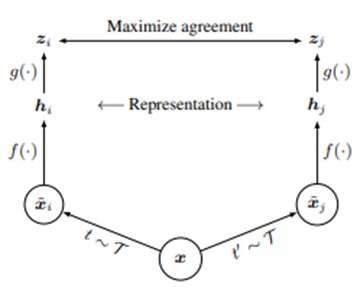
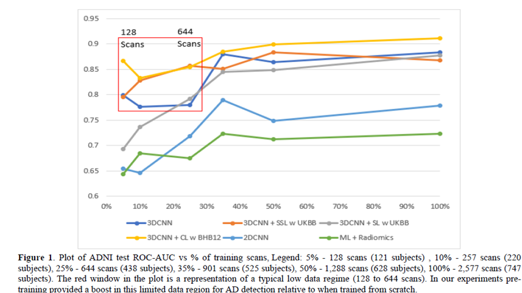

Title: Transfer Learning for Neuroimaging 
summary: Highlights of the SIPAIM 2022 paper "Evaluation of transfer learning methods for detecting Alzheimer’s disease with Brain MRI"
js:
css:
exts:
    -markdown.extensions.meta
    -markdown.extensions.headerid
    -markdown.extensions.tables
    markdown.extensions.toc
    -markdown.extensions.fenced_code
    -markdown.extensions.codehilite

This post summarizes findings of our SIPAIM 2022 paper [“Evaluation of transfer learning methods for detecting Alzheimer’s disease with Brain MRI,” (Dhinagar et al.)](https://www.biorxiv.org/content/biorxiv/early/2022/10/12/2022.08.23.505030.full.pdf)

## Model Details
- In this work, pre-training methods are evaluated to provide a feature backbone for automated diagnosis of Alzheimer’s disease (AD) based on brain MRI.
- Four main types of pre-training methods were tested - fully-supervised (in-domain), fully-supervised (out-of-domain), self-supervised, weakly-supervised learning.
- The two main 3D convolutional neural network (CNN) backbones tested in this paper are ResNet18 and DenseNet121.
- Data-scaling curves show the effect of training sample size on test-time model performance for different pre-training strategies.

## Intended Use
- Intended to be used for a wide range of neuroimaging tasks as an initialization strategy.
- Intended to provide a boost in performance especially when only limited training data is available for a given downstream task.
- Not tested yet on tasks other than AD diagnosis using T1-weighted brain MRI.

## Metrics
- Area under the receiver characteristic curve (ROC-AUC).
- Performance metrics based on the ROC curve including accuracy, precision, recall, F1-score.
- Optional use of Youden’s index to optimize the threshold selection from the ROC curve.

## Training Data
- Trained on 2,577 (from 747 subjects) T1-weighted brain MRI scans from the Alzheimer’s Disease Neuroimaging Initiative (ADNI). Additional details are in the reference below.

## Evaluation Data
- Models tested on a test set with 1,219 T1-weighted scans (from 359 subjects) from ADNI.
- 600 scans (600 subjects) from the Open Access Series of Imaging Studies, phase 3 (OASIS) - used as an out-of-distribution dataset to independently validate generalization capability.

## Brief description of Contrastive learning: 

<figure class="image">
  
  <figcaption></figcaption>
</figure>

A simple framework for contrastive learning of visual representations. Two separate data augmentation operators are sampled from the same family of augmentations (t ∼ T and t’ ∼ T) and applied to each data example to obtain two correlated views. A base encoder network f(·) and a projection head g(·) are trained to maximize agreement using a contrastive loss. After training is completed, we throw away the projection head g(·) and use encoder f(·) and representation h for downstream tasks. [Reference for the figure above and text description below: T. Chen et al., “A Simple Framework for Contrastive Learning of Visual Representations,” ICML, 1597–1607, 2020.]

## Quantitative Analysis

<figure class="image">
  
  <figcaption></figcaption>
</figure>

## Key Takeaway:
- Contrastive learning-based pre-training boosted performance by 7.7% for AD diagnosis using T1 MRIs in a limited training data setting.

## Caveats and Recommendations
- While these hyperparameters and training strategies in the paper were tested for the experiments proposed in the paper, additional tuning maymight be required given different architectures, tasks, and datasets.

## References:
- T. Chen, et. al, “A Simple Framework for Contrastive Learning of Visual Representations,” ICML, 1597–1607, 2020.
- B. Dufumier, et al., “Contrastive Learning with Continuous Proxy Meta-data for 3D MRI Classification,” MICCAI 2021.
- N.J. Dhinagar et al., “Evaluation of transfer learning methods for detecting Alzheimer’s disease with Brain MRI,” 18th International Symposium on Medical Information Processing and Analysis, SPIE SIPAIM 2022. 
