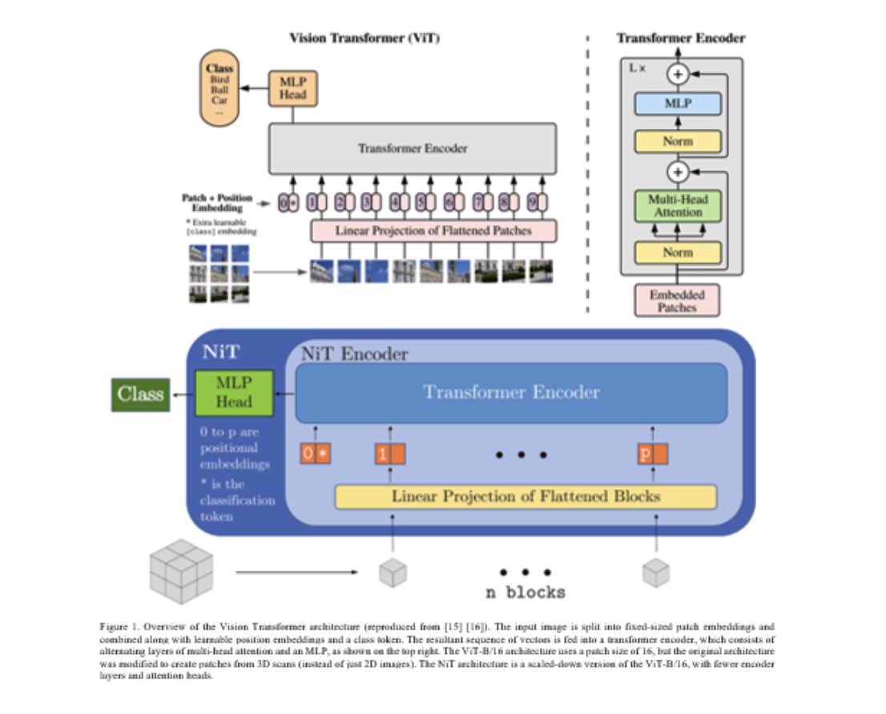
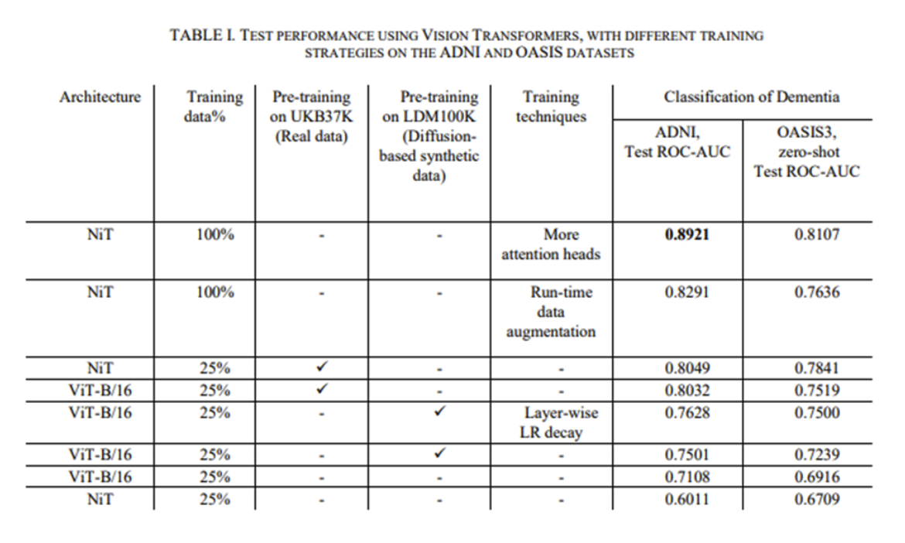

Title: ViTs for Alzheimer's Disease Detection
summary: Highlights of the EMBC 2023 paper "Efficiently Training Vision Transformers on Structural MRI Scans for Alzheimer’s Disease Detection"
js:
css:
exts:
    -markdown.extensions.meta
    -markdown.extensions.headerid
    -markdown.extensions.tables
    markdown.extensions.toc
    -markdown.extensions.fenced_code
    -markdown.extensions.codehilite

# Efficiently Training Vision Transformers on Structural MRI Scans for Alzheimer’s Disease Detection

## Model Details
- The vision transformer (ViT) class of architectures were trained and tested for the AD diagnosis task based on brain MRI.
- Two main variants of the ViTs included in this paper were the ViT B/16 and the scaled-down version called NiT.
- Two main variants of the ViTs included in this paper were the ViT B/16 and the scaled down version called NiT.
- We show the potential of pretraining on synthetic MRI scans for neuroimaging tasks.
- We present the effect of advanced training strategies like learning rate decay with warmups, mixup data augmentation.
- Data-scaling curves show the effect of training sample size on test-time performance of the Vision Transformer.

<figure class="image">
  
  <figcaption></figcaption>
</figure>

## Intended Use
- Intended to be used for a wide range of neuroimaging tasks.
- Potential to match and outperform CNN architectures with the use of the appropriate architecture and pre-training/fine-tuning strategies.
- Not tested on tasks other than AD diagnosis using T1-weighted brain MRI.
## Metrics
- Area under the receiver characteristic curve (ROC-AUC).
- Performance metrics based on the ROC curve including accuracy, precision, recall, F1-score.
- Optional use of Youden’s index to optimize the threshold selection from the ROC curve.

## Training Data
- Trained on 2,577 (from 747 subjects) T1-weighted brain MRI scans from Alzheimer’s Disease Neuroimaging Initiative (ADNI). Additional details in the reference below.
- 38,710 T1-w scans from the UK Biobank and 100,000 from the LDM100K dataset were used for pre-training.

## Evaluation Data
- Models tested on a test set with 1,219 T1-w scans (from 359 subjects) from ADNI.
- 600 scans (600 subjects) from Open Access Series of Imaging Studies, phase 3 (OASIS) used as an out-of-distribution dataset to independently validate generalization capability.

## Caveats and Recommendations
- While the hyperparameters and training strategies in the paper were tested for the experiments proposed in the paper, additional tuning might be required given different architectures, tasks, and datasets.

## Quantitative Analysis
<figure class="image">
  
  <figcaption></figcaption>
</figure>

## Key Takeaway
New vision transformer class of architectures for AD diagnosis using T1-weighted MRI was tested to boost performance by 1% from scratch compared to CNN; and 9% and 5% using pre-training on real and synthetic data, respectively.